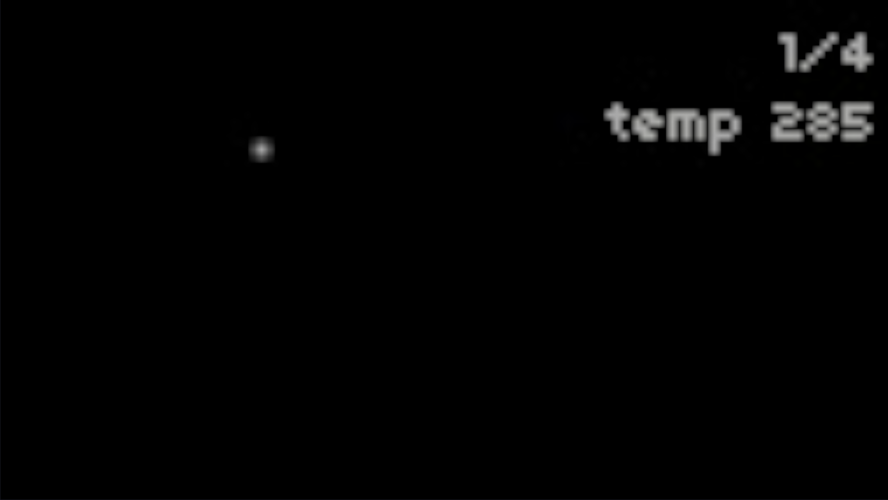
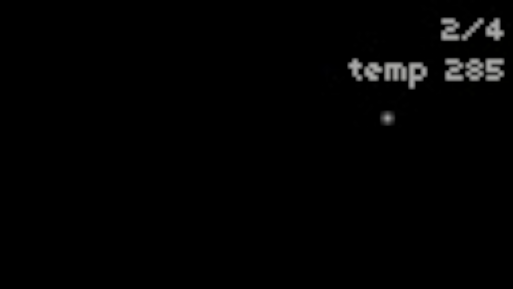
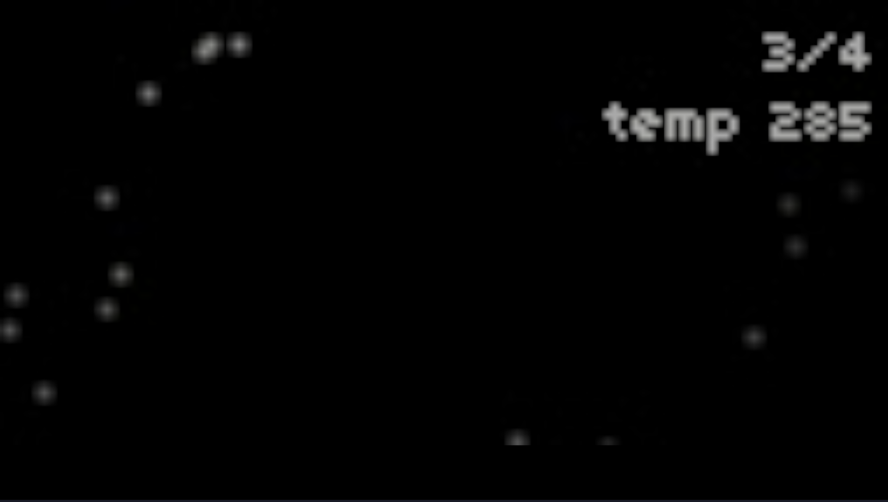

Agave

Data Sonification tool for monome norns using CAM photosynthetic model.

Demonstration: coming soon
Lines thread: coming soon

# Overview

The model synthesizes sound based on the parameters malic acid content and circadian order from photosynthetic models of CAM (Crassulacean Acid Metabolism) plants. built on an adapted Farquhar et al. model parameterized for _Agave Tequilana_. The original model was adapted from Python to Lua for process implementation on the Monome Norns platform. The Norns uses a combination of Lua scripts and Supercollider scripts to achieve sound creation from model outputs. Features live controllable temperature parameter.

The script utilizes lua for the interface and data visualization. Supercolider generates the sonification. 

The sounds created by this script are produced by a lowpass sine fm synthesizer engine taken from [thebangs](https://github.com/catfact/thebangs), a one-shot polysynth engine created by @catfact. The following modulations of the synth engine occur in relation to changes in the CAM model as it is executed: 

* amplitude is mapped to the malic acid content (mn)
* the cutoff of the synth's lowpass filter is mapped to circadian order (z)
* as execution of the model transitions from z > 0.5 to z < 0.5, the sounds change from a minor chord to a major chord and represents the transition from daytime to night time.

## Controls
    
  Encoder 1: Changes Display screen

  Encoder 2: (screens 1-3) Changes light levels along 6 pre-set watts/m^2 values.
      Light levels are: 10, 50, 150, 300, 500

  Encoder 3: (screens 1-3) Changes Temperature Settings along 5 pre-set kelvin temperatures.
      Temps are: 285, 289, 293, 297, 301.

## Screens

There are four screens available to view on the Norns device. Sonification occurs on screens 1-3.
  
  1. Malic Acid over time display
     
        This screen shows the change in malic acid content over the duration of the model. It can be changed to each of the temperature settings to see how the pixel movement changes at each temperature setting
  
  2. Circadian Order over time display
     
        This screen shows the change in circadian order over the duration of the model. It can be changed to each of the temperature settings to see how the pixel movement changes at each temperature setting
  
  3. Malic Acid vs Circadian Order
     
        This screen has the two parameters mapped against one another showing the limit cycle created by these two variables. Temperature settings are available here in order to see how the limit cycle moves to a fixed point with the increased temperature. 
  
  4. Bifurcation Diagram Temperature vs Circadian Order
     
        Displays a bifurcation diagram based on conditions that force the model into chaos.

# Requirements
* [monome norns](https://monome.org/norns)

# Installation
;install https://github.com/samhartz/agave

# Authors
Original model by Samantha Hartzell, Mark Bartlett, and Amilcare Porporato

Data Sonification and Bifurcation scripts by [Jonathan Snyder](http://instagram.com/jaseknighter) and Duncan Turley

#References

Model is referenced in paper:

_Hartzell, Samantha, et al. “Nonlinear Dynamics of the CAM Circadian Rhythm in Response to Environmental Forcing.” Journal of Theoretical Biology, vol. 368, 7 Mar. 2015, pp. 83–94, https://doi.org/10.1016/j.jtbi.2014.12.010._
